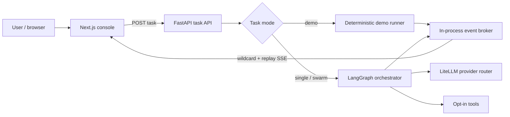

# Swarm Workbench

[简体中文](README.zh-CN.md)

[](https://github.com/Richerwang228/swarm-workbench/actions/workflows/ci.yml)
[](https://github.com/Richerwang228/swarm-workbench/actions/workflows/codeql.yml)
[](LICENSE)
[](pyproject.toml)
[](apps/web/package.json)

**A local-first workbench for observing how a bounded group of AI agents plans,
works in parallel, and reports its trace.**


> [!IMPORTANT]
> This is a portfolio-grade reference implementation and public beta, not a
> production agent framework. The built-in demo is deterministic and simulated;
> live LLM execution is optional and experimental.

## Why this project

Multi-agent demos often show only the final answer. Swarm Workbench makes the
execution legible: task decomposition, role assignment, bounded concurrency,
todo state, tool activity, streaming output, and aggregation are visible through
one event contract.

The repository is intentionally narrow. It aims to be easy to run and inspect,
while documenting where prototype behavior ends and production engineering would
begin.

## What works today

- A no-key, no-network demo that completes an observable four-role workflow.
- `single`, `swarm`, and heuristic `auto` orchestration paths for optional live
  providers.
- Bounded parallel dispatch with deterministic todo result merging.
- FastAPI task API and SSE with wildcard subscriptions and bounded replay.
- Next.js console with todo progress, agent cards, chat output, and activity feed.
- Provider routing through LiteLLM when the user supplies environment variables.
- Workspace-scoped file tools; host shell execution is disabled by default.
- Python unit/integration tests and frontend lint, typecheck, and production build.

See the evidence-based [capability status](docs/STATUS.md) before evaluating a
feature claim.

## Quickstart: no API key

Requirements: Python 3.12, Node.js 22, [uv](https://docs.astral.sh/uv/), and
[pnpm](https://pnpm.io/).

```bash
git clone https://github.com/Richerwang228/swarm-workbench.git
cd swarm-workbench

uv sync --locked
pnpm --dir apps/web install --frozen-lockfile
./start.sh --demo
```

Open [http://127.0.0.1:3000](http://127.0.0.1:3000), select **Load sample**,
and press **Send**. The demo makes no model request and does not execute host
tools.

## How it works



Both execution paths emit task, todo, agent, tool, and content events. The UI
does not need to understand how an agent was implemented. Read
[Architecture](docs/ARCHITECTURE.md) for component responsibilities and runtime
sequence.

## Demo mode versus live mode

| | Demo | Live providers |
|---|---|---|
| API key | None | At least one supported provider key |
| Network | None | Provider requests; search tool may use the network |
| Agent output | Deterministic simulation | Model-generated |
| Host shell | Disabled | Disabled unless explicitly enabled |
| Best use | Evaluation, UI testing, contribution setup | Experimental local tasks |

To try live execution:

```bash
cp .env.example .env
# Set SWARM_DEMO_MODE=false and configure at least one provider.
./start.sh
```

Never commit `.env`. Provider requests can incur cost. Review
[the security model](docs/SECURITY_MODEL.md) before enabling tools.

## Configuration

| Variable | Default | Purpose |
|---|---:|---|
| `SWARM_DEMO_MODE` | `true` | Keep the no-key demo as the default path |
| `SWARM_MODEL` | — | LiteLLM provider-qualified model name |
| `SWARM_API_BASE` | — | OpenAI-compatible provider base URL |
| `SWARM_API_KEY` | — | Provider credential; never commit it |
| `MAX_CONCURRENT_SUBAGENTS` | `5` | Process-wide upper bound, capped at 8 by the API |
| `ALLOW_LOCAL_EXECUTION` | `false` | Explicit opt-in for host shell execution |
| `WORKSPACE_ROOT` | `data/workspace` | Canonical root for file and shell tools |
| `SWARM_CORS_ORIGINS` | local port 3000 | Comma-separated browser origins |

Provider placeholders are documented in [`.env.example`](.env.example).

## Development and verification

```bash
./scripts/verify.sh
```

This runs Python tests, Ruff, mypy, ESLint, TypeScript, and the Next.js
production build. Contribution expectations are in
[CONTRIBUTING.md](CONTRIBUTING.md).

## Security

Agents can turn untrusted model output into tool calls. That is a real security
boundary, even for a local application.

- Host shell execution is off by default.
- File paths are resolved canonically and symlink escapes are rejected.
- Real secrets are ignored; only `.env.example` is tracked.
- The public demo does not use models, the network, or host tools.
- CI runs CodeQL, dependency updates, and secret scanning.

This beta is not a hardened sandbox. Do not run untrusted live tasks with local
execution enabled. Read [SECURITY.md](SECURITY.md) and
[the full threat model](docs/SECURITY_MODEL.md).

## Known limitations

- Checkpoints and event replay are process-local and are lost after restart.
- Live provider behavior depends on third-party APIs and has mocked CI tests.
- Cancellation, public share links, browser automation, E2B sessions, MCP
  discovery, and git worktree merge automation are not implemented.
- The demo proves the product/event path, not model quality or benchmark gains.
- There is no authentication or multi-tenant isolation; bind to localhost only.

These are tracked in [Roadmap](docs/ROADMAP.md), not presented as completed
features.

## Repository map

```text
apps/
  api/             FastAPI task and SSE endpoints
  web/             Next.js observable agent console
packages/
  orchestrator/    Demo runner and LangGraph orchestration
  eventbus/        Wildcard topic delivery and bounded replay
  worker/          Model/tool loop and role prompts
  tools/           Supported workspace tools
tests/
  unit/            Component contracts and security boundaries
  integration/     Demo, graph, stream, and health paths
docs/              Architecture, status, security, roadmap, plans
```

## Project governance

- Bugs and proposals: [GitHub Issues](https://github.com/Richerwang228/swarm-workbench/issues)
- Usage questions: [SUPPORT.md](SUPPORT.md)
- Vulnerabilities: [SECURITY.md](SECURITY.md)
- Contributions: [CONTRIBUTING.md](CONTRIBUTING.md)
- Conduct: [CODE_OF_CONDUCT.md](CODE_OF_CONDUCT.md)

## Acknowledgements

The design is informed by public work around LangGraph, LiteLLM, FastAPI,
AutoGen, CrewAI, CAMEL, MetaGPT, and other agent systems. Private research
checkouts are not included. See [THIRD_PARTY_NOTICES.md](THIRD_PARTY_NOTICES.md).

## License

Apache-2.0. See [LICENSE](LICENSE).
