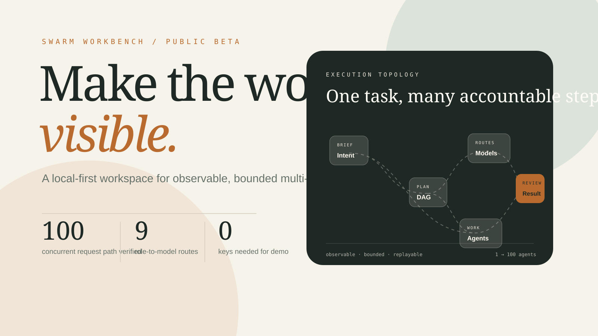
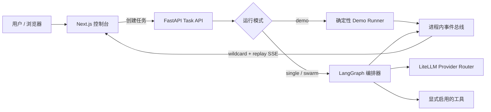

# Swarm Workbench

[English](README.md)

**一个本地优先、多 Provider 的 Agent Runtime：最多编排 100 个真实模型
Agent，并让用户自行决定不同角色使用哪一家 API 和哪个模型。**



> [!IMPORTANT]
> 这是作品集级参考实现和公开 Beta，不是可直接暴露到公网的生产服务。
> Runtime 已通过 100 个同时在途的 OpenAI-compatible 请求契约测试；真实厂商
> 的吞吐、费用与限流取决于用户账号，不能由本地测试代替。

## 为什么做这个项目

很多多 Agent 项目只展示最终答案，看不出多个 Agent 为什么存在、如何协作、
哪里失败。Swarm Workbench 用统一事件契约把任务拆解、角色分配、受限并发、
Todo 状态、工具调用、流式输出和结果聚合呈现在同一个控制台中。

本项目刻意控制范围：先做到容易运行、容易审查、容易解释；尚未完成的生产
能力会清楚写入限制和路线图，而不是包装成已经可用。

## 当前真正可用的能力

- 无需 API Key、无需联网的四角色可观测 Demo。
- `SWARM 100 · SIMULATED` 确定性调度容量基准。
- 一次生成固定 DAG，最多包含 100 个有唯一身份的真实 Worker Agent。
- 多 Provider、多模型配置，以及 Planner、PM、Designer、Frontend、Backend、
  Tester、Ops、Reducer、Summarizer 九类角色的模型路由。
- 全局/单模型并发限制、任务调用预算、工具预算、单 Agent 步数、墙钟超时和
  父任务取消传播。
- 分层 Reduce，避免把 100 份完整结果一次塞进同一个模型上下文。
- 可选真实 Provider 的 `single`、`swarm`、`auto` 编排路径。
- 有并发上限的任务派发和确定性的 Todo 结果合并。
- FastAPI 任务 API，以及支持 wildcard 和有限 replay 的 SSE。
- Next.js 控制台：Todo、Agent 工牌、对话结果、实时活动。
- 用户自行配置环境变量后，通过 LiteLLM 路由真实模型。
- 文件工具限制在 workspace 内；本机 shell 默认关闭。
- Python 单元/集成测试和前端 lint、类型检查、生产构建。

每一项状态请以 [能力矩阵](docs/STATUS.md) 为准。

集成测试会启动本地 OpenAI-compatible Server，让 100 个 Worker 各完成一次
真实 HTTP 流式请求，并验证峰值 100 个请求同时在途。它证明调度器和 Provider
链路，但不证明某个商业 Provider 的 quota 或模型质量。详见
[Live 100 证据与边界](docs/LIVE_100.md)。

## 五分钟启动：无需 API Key

需要 Python 3.12、Node.js 22、[uv](https://docs.astral.sh/uv/) 和
[pnpm](https://pnpm.io/)。

```bash
git clone https://github.com/Richerwang228/swarm-workbench.git
cd swarm-workbench

uv sync --locked
pnpm --dir apps/web install --frozen-lockfile
./start.sh --demo
```

打开 [http://127.0.0.1:3000](http://127.0.0.1:3000)，点击“加载示例”，
再点击“发送”。这个 Demo 不请求模型，也不执行本机工具。

## 架构



Demo 和真实执行都使用相同的 task、todo、agent、tool、content 事件契约。
完整组件职责和时序见 [架构文档](docs/ARCHITECTURE.md)。

## 使用真实模型

打开页面右上角 **Providers**：

1. 添加一家或多家 Provider，填写 Base URL、API Key 和模型名；
2. 为九种角色分别选择模型；
3. 分开设置 Agent 数量和最大并发；
4. 在 `集群` 模式中选择是否强制精确 Agent 数量。

通过页面提交的 Key 只保存在 API 进程内存，读取接口不会返回，重启后自动
清除。真实请求可能产生费用。

```bash
cp .env.example .env
# 将 SWARM_DEMO_MODE 改为 false，并配置 SWARM_MODEL、
# SWARM_API_BASE 和 SWARM_API_KEY。
./start.sh
```

不要提交 `.env`。真实 Provider 可能产生费用；搜索工具可能联网。启用工具前
请阅读 [安全模型](docs/SECURITY_MODEL.md)。

## 验证

```bash
./scripts/verify.sh
```

它会运行 Python 测试、Ruff、mypy、ESLint、TypeScript 和 Next.js 生产构建。

## 安全边界

- 本机 shell 默认关闭。
- 页面提交的 API Key 为 write-only、process-memory-only。
- 原生 Provider 类型固定走 LiteLLM 官方端点；自定义 Base URL 必须走明确的
 兼容模式。页面配置的远程自定义地址要求 HTTPS，并检查字面与当前 DNS 解析后的
 私网地址；这不是请求时的出站代理防护。
- 启动脚本只绑定 loopback，并限制 CORS 和 Host header。
- 文件路径会做 canonical resolve，并拒绝 symlink 逃逸。
- Demo 不使用模型、网络或本机工具。
- 不要把密码、API Key 或个人秘密写入 Prompt/工具输入：任务仍存活时，本地事件
  历史可见这些内容。
- 仓库只跟踪 `.env.example`，不跟踪真实环境文件。
- CI 持续执行 CodeQL、依赖更新和密钥扫描。

本 Beta 没有生产级沙箱。不要在 `ALLOW_LOCAL_EXECUTION=true` 时运行不可信
任务。详见 [SECURITY.md](SECURITY.md)。

## 已知限制

- Checkpoint、Provider 配置和事件 replay 只存在于当前进程，重启后丢失。
- 100 并发契约测试使用本地兼容 Server；尚未使用仓库维护者的真实商业
  Provider 完成可公开的 100-Agent canary。
- 未知自定义模型无法可靠执行美元预算；当前强制执行调用数、工具数、步数、
  并发和总时长预算。
- 公开分享、浏览器自动化、E2B、MCP、持久恢复和隔离 worktree 合并尚未实现。
- Demo 证明的是产品和事件闭环，不证明模型效果优于单 Agent。
- 没有鉴权和多租户隔离，只应绑定 localhost。

后续计划见 [Roadmap](docs/ROADMAP.md)。

## 参与项目

- [贡献指南](CONTRIBUTING.md)
- [问题与支持](SUPPORT.md)
- [安全漏洞报告](SECURITY.md)
- [行为准则](CODE_OF_CONDUCT.md)
- [第三方说明](THIRD_PARTY_NOTICES.md)

## License

Apache-2.0，见 [LICENSE](LICENSE)。
